# MDPL-01
MATERI MDPL PERTEMUAN 1
 Nama: Tegar Agil Nugroho
 NIM: 5200411015
 

## pengertian Git dan Github

 Git merupakan software berbasis Version Control System (VCS) yang bertugas untuk mencatat perubahan seluruh file atau repository suatu project. Developer software biasa menggunakan Git untuk distributed revision (VCS terdistribusi), hal ini bertujuan untuk menyimpan database tidak hanya ke satu tempat. Namun semua orang yang terlibat dalam penyusunan kode dapat menyimpan database ini.

Prosedur yang diterapkan ini dapat membantu antar divisi project untuk memantau dan menghubungkan (merge) antar ekstensi yang berbeda dengan mudah. Sehingga aplikasi yang dibuat oleh sebuah tim project dapat berfungsi tanpa menghubungkan secara manual.

Terdapat istilah commit pada Git yang berfungsi untuk menyimpan riwayat perubahan data pada file. Melalui commit, developer dapat kembali ke source code sebelumnya dengan istilah checkout.

Untuk mengoperasikan Git, kamu perlu menginstall software terlebih dahulu sehingga pekerjaan ini dapat dilakukan secara offline (tidak terkoneksi internet). Software ini juga tersedia secara gratis melalui web unduhan resminya di Git Downloading.

 GitHub merupakan layanan cloud yang berguna untuk menyimpan dan mengelola sebuah project yang dinamakan repository (repo git). Cara kerja pada GitHub harus terkoneksi pada internet sehingga tidak perlu meng-install sebuah software ke dalam perangkat keras. Hal ini memberikan keringanan penyimpanan komputer yang kita gunakan karena file project tersiGitHub merupakan layanan cloud yang berguna untuk menyimpan dan mengelola sebuah project yang dinamakan repository (repo git). Cara kerja pada GitHub harus terkoneksi pada internet sehingga tidak perlu meng-install sebuah software ke dalam perangkat keras. Hal ini memberikan keringanan penyimpanan komputer yang kita gunakan karena file project tersimpan oleh cloud GitHub.

Konsep kerja GitHub pada dasarnya sama dengan Git yaitu dapat menulis source code secara individu atau tim. User interface yang tersedia pada GitHub lebih menarik dan mudah dipahami oleh pengguna awal. Pekerjaan secara tim, pengguna juga bisa melihat siapa penulis kode dan tanggal berapa kode tersebut dibuat.

Terdapat fitur lain pada GitHub yaitu kita dapat membaca berbagai blog dan feed yang dibuat oleh sesama pengguna. Hal ini dimanfaatkan oleh pengguna seluruh dunia untuk saling berbagi ide pemrograman dan berdiskusi dalam menyelesaikan masalah. Tentunya postingan yang ada pada GitHub berkaitan dengan pemrograman. Sehingga Github telah menjadi forum diskusi para programmer seperti halnya media sosial.mpan oleh cloud GitHub.

Konsep kerja GitHub pada dasarnya sama dengan Git yaitu dapat menulis source code secara individu atau tim. User interface yang tersedia pada GitHub lebih menarik dan mudah dipahami oleh pengguna awal. Pekerjaan secara tim, pengguna juga bisa melihat siapa penulis kode dan tanggal berapa kode tersebut dibuat.

Terdapat fitur lain pada GitHub yaitu kita dapat membaca berbagai blog dan feed yang dibuat oleh sesama pengguna. Hal ini dimanfaatkan oleh pengguna seluruh dunia untuk saling berbagi ide pemrograman dan berdiskusi dalam menyelesaikan masalah. Tentunya postingan yang ada pada GitHub berkaitan dengan pemrograman. Sehingga Github telah menjadi forum diskusi para programmer seperti halnya media sosial.
 
## Cara Menginstal Git di Windows
  1.disini saya menggunakan os windows, ini langkah-langkah
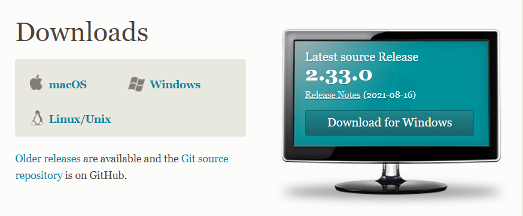
 itu merupakan potongan ss awal dari mendownload github. mohon sesuakain OS kalian
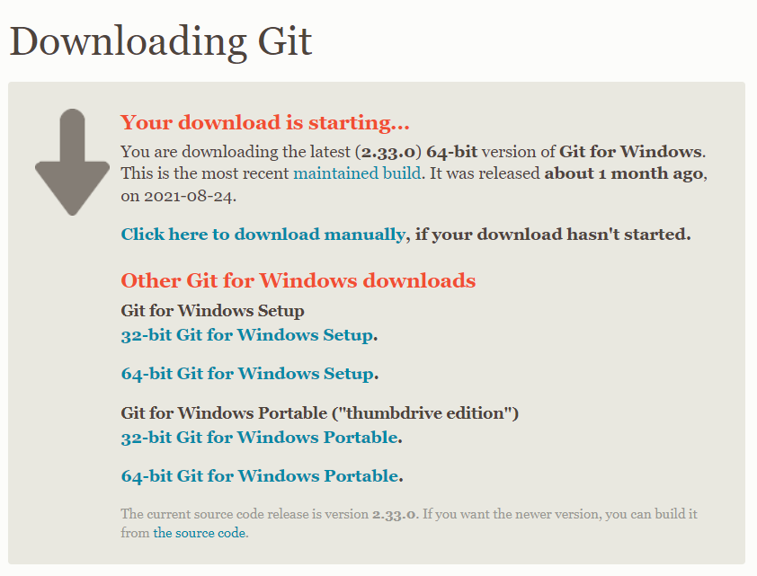
  jika sudah selesai mendowonload, maka kalian akan disuruh memilih versi 32 bit atau 64 bit. Sesuikan saja dengan device anda
 2.Kemudian buka file installernya. akan muncul gambar ini
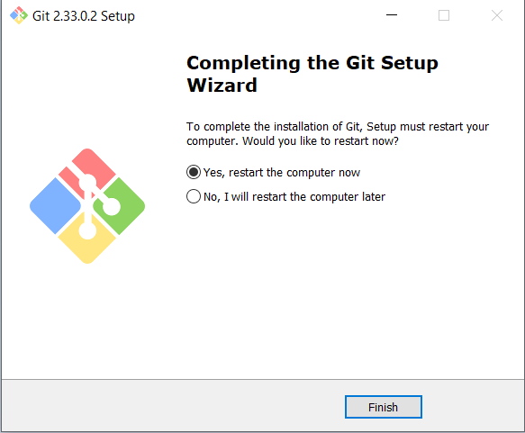
 3.Setup sudah dimulai silahkan klik next next saja dan sesuaikan dengan kebutuhan, tetapi saya sarankan sesuai default saja jika ragu atau tidak terlalu paham maksudnya. Bisa juga dengan searching google jika ingin tau maksudnya. Disini saya akan menjelaskan beberapa setup yang mungkin akan diganti.
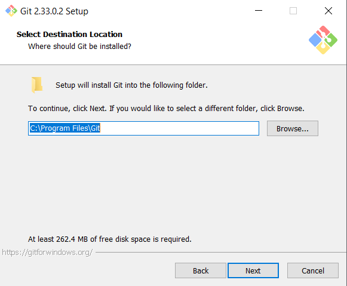
 4. Gambar di atas adalah setup file dari git dan git tersebut akan di install dimana. Misal : default = C:\Program Files\Git anda bisa menggantinya ke yang lain.
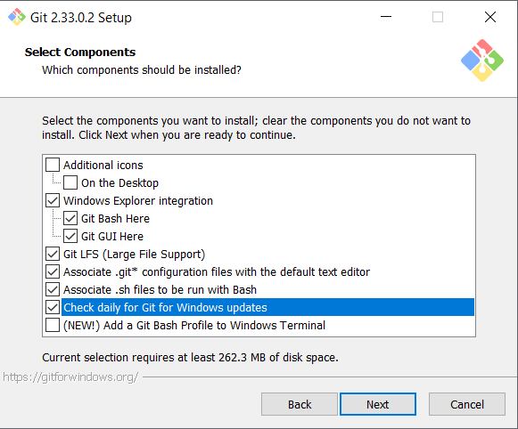
 5. Gambar di atas adalah Component yang akan terinstall di device kalian. Disini saya menambahkan centang ke Check Daily for Windows Update karena ingin mendapatkan update git ketika menyalakan Windows Update
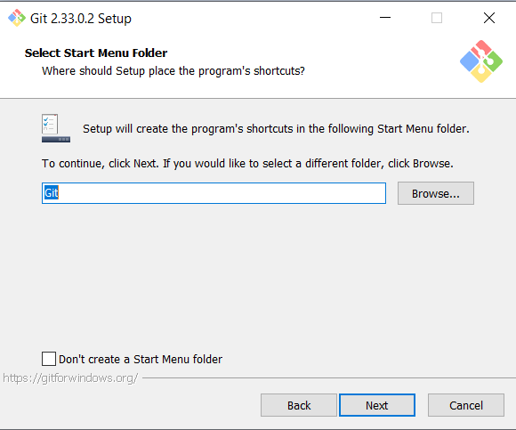
 6. Gambar di atas adalah nama Menu Folder Startup, kalian bisa mengganti namanya. Menu Folder Startup ini adalah ketika kalian klik logo Windows yang ada di keyboard.
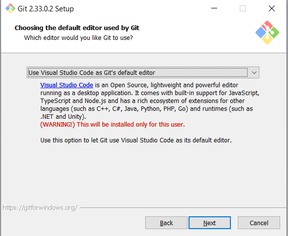
 7. Disini adalah pemilihan Code Editor. Default nya adalah Vim tetapi saya ubah menjadi Visual Studio Code karena menurut saya lebih mudah. Jika vim biasa digunakan untuk Linux. Kalian bisa menyesuaikan dengan kebutuhan juga.
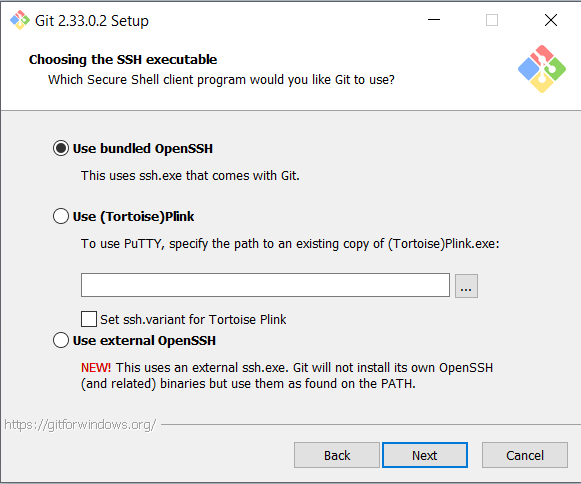

 8. Konfigurasi selanjutnya adalah Setting SSH serta SSL. Jika tidak terlalu paham maksudnya saya sarankan untuk default saja. Saya disini setting Default semua
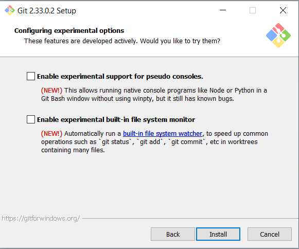
 9. Gambar di atas adalah Experimental Configuration. Mungkin ini ditujukan untuk yang membutuhkan.
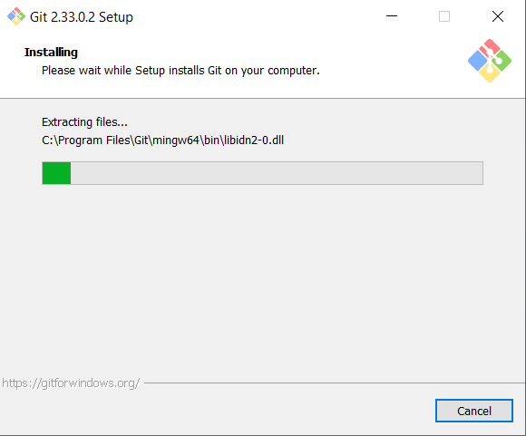
 10. Proses Instalasi

 11. Instalasi Selesai. Disarankan untuk Restart PC atau Device.
Jika Instalasi selesai silahkan cek di Folder Startup dengan cara klik logo Windows. Akan ada beberapa aplikasi : Git Bash, Git Gui, Git CMD
Untuk mengecek versi git kalian bisa buka CMD/Powershell atau Git CMD. Cara pemanggilan = git --version

# Mengelola Repo
 Beberapa cara untuk mengelola repo adalah sebagai berikut =
1. Membuat repositori kosong di github
2. Upload file lokal ke repository github dengan git add dan git push
3. Download file di repo github ke lokal dengan git clone

# 1. Membuat Repositori Kosong Di Github
 
- Buka website github dan login ke akun github
- Cari tanda + di bagian kanan atas (Letaknya bersebelahan dengan gamb ar profile)
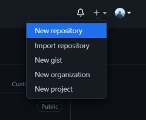
  
- Selanjutnya pilih New Repository atau jika bahasa Indonesia adalah Repositori Baru
- Jika sudah akan muncul opsi seperti dibawah ini
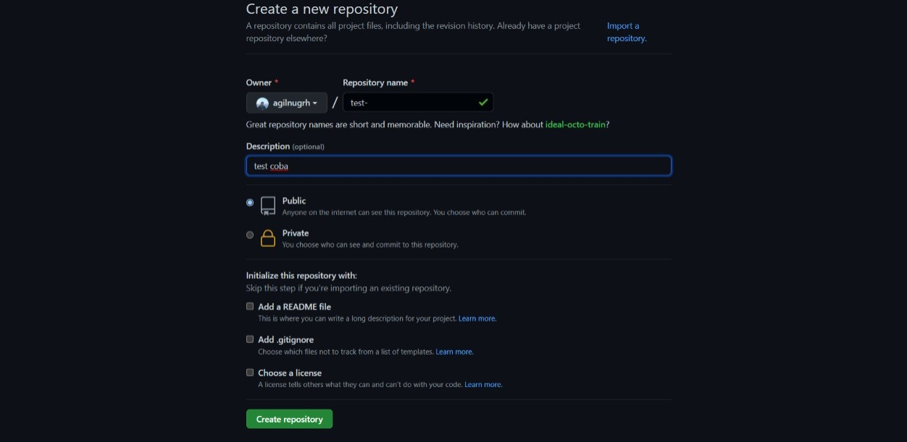
  - Silahkan isikan nama repo dan deskripsi repo tersebut. Bisa di setting Public ataupun Private (Jika publik berarti data repo akan di publikasikan). Bisa juga menambahkan Lisensi. Ada juga .gitignore yang dapat mengabaikan file yang sudah kita masukan ke list .gitignore, Sebagai contoh ada seorang dev aplikasi yang menggunakan git dia ingin salah satu file nya tidak diketahui oleh orang yang mendownload repo atau untuk melihat repo tsb. Maka dengan gitignore kita dapat mengabaikan file tersebut agar tidak di track oleh orang lain.
- Selanjutnya silahkan klik "Create Repository" dan tara repo baru berhasil dibuat

## 2. Upload File Ke Repository Github
 - Siapkan terlebih dahulu file yang ingin ditambah ke repo github
- Cek terlebih dahulu dengan git status untuk mengecek status di repo github
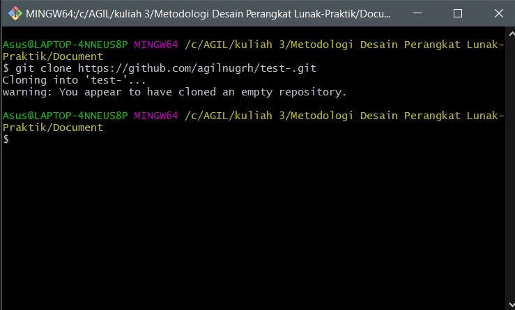
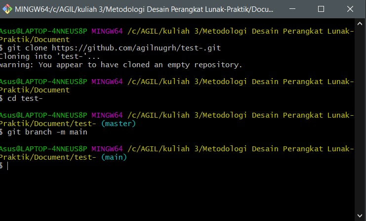
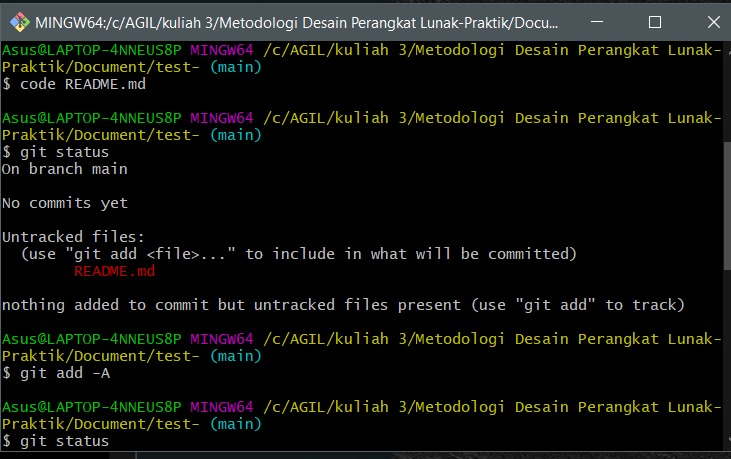